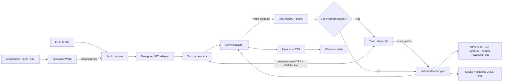

# JARVIS Desktop Assistant

JARVIS is a modular, local-first Windows desktop assistant. It lives in the system tray, waits for a local wake phrase or push-to-talk shortcut, transcribes only after activation, asks Gemini to reason over an explicit registry of typed tools, confirms sensitive actions, and speaks concise results through local Piper text-to-speech.

This repository contains working Python services, a React/Tauri desktop host, an authenticated localhost protocol, persistent SQLite settings and audit history, safe Windows tools, automated tests, mock providers, packaging scripts, and operational documentation. It does **not** contain API keys, raw recordings, licensed Piper voices, or a fabricated custom wake model.

## What it does

- Runs as a Windows 10/11 tray application and minimizes to the notification area.
- Supports local openWakeWord activation, with **Hey Jarvis** as the reliable stock phrase and a custom-model path for bare **Jarvis**.
- Keeps pre-activation microphone audio on the device.
- Streams post-activation PCM audio to Deepgram, including interim and final transcripts, endpointing, cancellation, and bounded timeouts.
- Uses Gemini structured function calling without allowing Gemini to execute functions automatically.
- Exposes only enabled, registered tools with Pydantic argument validation and structured results.
- Forces fresh, exact-action confirmation for high-risk operations.
- Speaks locally with Piper and allows speech cancellation/interruption.
- Stores settings, permissions, redacted activity, confirmation decisions, and summaries in SQLite—never API keys or raw audio.
- Includes a complete mock pipeline that needs no microphone, API credits, Piper binary, or wake model.

## Architecture



The Python backend binds to `127.0.0.1` only. On each packaged desktop launch, Tauri generates a 256-bit random session token and a one-time readiness nonce, then asks the backend to bind port `0`. Only after FastAPI startup does the backend atomically report its actual port, nonce, runtime PID, and parent PID. Tauri verifies the nonce, that the runtime is either the spawned process or its direct child, a safe port, and an authenticated health request before returning connection details to the webview through a narrow command. HTTP uses `X-Assistant-Token`; WebSocket clients must authenticate in their first frame before receiving any state.

See [docs/ARCHITECTURE.md](docs/ARCHITECTURE.md) for the state machine, protocol, provider contracts, storage model, and process lifecycle.

## Technology

| Layer | Technology |
| --- | --- |
| Desktop host | Tauri 2, Rust, tray menu, autostart, single-instance, global shortcut |
| Interface | React, strict TypeScript, Vite, accessible hand-written CSS |
| Assistant service | Python 3.11+, FastAPI, Pydantic, asyncio |
| Reasoning | Google Gemini GenerateContent/function-calling API through an isolated `httpx` adapter |
| Post-wake STT | Deepgram streaming WebSocket adapter |
| Optional local STT | User-operated Willow Inference Server adapter |
| Wake phrase | openWakeWord, local 16 kHz PCM |
| Speech | Piper, local subprocess and cancellable playback |
| Memory | SQLite through `aiosqlite` |
| Windows control | Native/standard APIs first, then UI Automation, pywin32, and named PowerShell operations |
| Quality | Pytest, Ruff, Vitest, Testing Library, ESLint, TypeScript, Cargo |

## Repository map

```text
apps/desktop/                 React UI and Tauri 2 tray host
  src/                        pages, state, protocol client, accessible components
  src-tauri/                  Rust lifecycle, tray, shortcut, autostart, sidecar host
services/assistant/           Python assistant service
  config/                     development, production, and permission defaults
  src/jarvis_assistant/       API, providers, state machine, safety, memory, tools
  tests/                      unit and integration tests with mocked vendors
shared/
  schemas/                    JSON Schemas for protocol, tools, settings, activity
  types/                      shared TypeScript message and settings types
scripts/                      setup, development, test, Piper, and installer scripts
docs/                         architecture, security, tools, providers, troubleshooting
```

## Windows prerequisites

1. Windows 10 or 11.
2. Python 3.11 or newer. CPython x64 is recommended because all optional audio and Windows wheels are most consistently available there.
3. Node.js 20 or newer and npm 10 or newer.
4. For the Tauri window or installer:
   - [Rust via rustup](https://rustup.rs/)
   - [Microsoft C++ Build Tools](https://visualstudio.microsoft.com/visual-cpp-build-tools/) with **Desktop development with C++**
   - Microsoft Edge WebView2 (normally already present on current Windows 10/11)
5. A microphone for live voice use.

## Setup

From PowerShell 7 in the repository root:

```powershell
Set-ExecutionPolicy -Scope Process Bypass
.\scripts\setup.ps1
Copy-Item .env.example .env  # only if setup did not create it
notepad .env
```

`setup.ps1` creates `.venv`, installs the assistant with Windows/wake/secure-storage extras, installs the desktop workspace, and reports missing Tauri prerequisites. For a smaller CI or mock-only environment:

```powershell
.\scripts\setup.ps1 -MockOnly
```

### Required live configuration

```dotenv
DEEPGRAM_API_KEY=your_deepgram_key
GEMINI_API_KEY=your_gemini_key
PIPER_EXECUTABLE_PATH=C:\Tools\piper\piper.exe
PIPER_MODEL_PATH=C:\Users\you\Voices\en_US-lessac-medium.onnx
```

Install Piper into its own local environment and validate a separately downloaded voice:

```powershell
.\scripts\install-piper.ps1 -VoiceModelPath "C:\Users\you\Voices\en_US-lessac-medium.onnx"
```

Review every voice model's license before downloading it. This repository intentionally does not redistribute voice data. The `.onnx.json` file supplied with most Piper voices must sit next to its `.onnx` model.

### Wake model

The openWakeWord project publishes a trained **Hey Jarvis** model. Its pretrained-model assets use CC BY-NC-SA 4.0, so they are not bundled in the repository or installer. Review those non-commercial/share-alike terms, then download the wake and required feature models into your per-user application-data directory:

```powershell
.\scripts\install-wake-model.ps1 -AcceptModelLicense
```

That model may sometimes react to “Jarvis,” but it is not a reliable pretrained bare-word model. For a compatible custom model, set:

```dotenv
OPENWAKEWORD_MODEL_PATH=C:\Users\you\WakeModels\custom_jarvis.onnx
OPENWAKEWORD_MELSPEC_MODEL_PATH=C:\Users\you\WakeModels\melspectrogram.onnx
OPENWAKEWORD_EMBEDDING_MODEL_PATH=C:\Users\you\WakeModels\embedding_model.onnx
ASSISTANT_WAKE_PHRASE=Jarvis
```

The backend reports a missing or incompatible model and leaves push-to-talk available; it never pretends that a model exists.

## Run

Complete Tauri desktop in mock mode:

```powershell
.\scripts\dev.ps1 -Mock
```

Complete Tauri desktop with live providers:

```powershell
.\scripts\dev.ps1
```

React UI plus hidden Python backend without Rust/Tauri (useful for UI development):

```powershell
.\scripts\dev.ps1 -Mock -WebOnly
```

Backend by itself:

```powershell
$env:ASSISTANT_SESSION_TOKEN = "replace-with-at-least-32-random-characters"
.\scripts\run-backend.ps1 -Mock
```

The default desktop shortcut is `Ctrl+Shift+J`; push-to-talk is `Ctrl+Space`. Both are configurable in settings. Closing the main window hides it; choose **Quit** from the tray menu to stop both the Tauri and Python processes.

## Test

The suite mocks Deepgram and Gemini and does not consume credits:

```powershell
.\scripts\test.ps1
```

Individual checks:

```powershell
.\.venv\Scripts\python.exe -m ruff check services/assistant/src services/assistant/tests
.\.venv\Scripts\python.exe -m pytest services/assistant/tests
npm run desktop:lint
npm run desktop:test
npm run desktop:build
cargo check --manifest-path apps/desktop/src-tauri/Cargo.toml
```

## Build a Windows installer

```powershell
.\scripts\build.ps1                  # NSIS + MSI
.\scripts\build.ps1 -Target nsis     # current-user setup.exe only
.\scripts\build.ps1 -Target msi      # MSI only
```

The build script runs all gates, creates a windowless PyInstaller backend sidecar, exercises that executable through the real Rust host readiness handshake, stages the target-triple-named binary, and invokes Tauri. Outputs are written below `apps/desktop/src-tauri/target/release/bundle/`.

Do a manual signed-build and hardware smoke test before distribution. Code signing is intentionally not automated because it requires an organization-controlled certificate and secure key handling.

## Environment variables

| Variable | Required | Purpose |
| --- | --- | --- |
| `DEEPGRAM_API_KEY` | live STT | Post-activation transcription; never logged or stored |
| `GEMINI_API_KEY` | live reasoning | Gemini requests; never logged or stored |
| `GEMINI_MODEL` | no | Gemini model identifier; defaults to a Flash model |
| `ASSISTANT_ENV` | no | `development`, `production`, or `mock` |
| `ASSISTANT_HOST` | no | Must remain `127.0.0.1`; non-loopback values are rejected |
| `ASSISTANT_PORT` | no | Explicit local API port override; packaged desktop otherwise makes the backend bind port `0`, while standalone development defaults to `8765` |
| `ASSISTANT_SESSION_TOKEN` | desktop-managed | Random local API credential |
| `ASSISTANT_LOG_LEVEL` | no | Structured local log level |
| `ASSISTANT_DATA_DIR` | no | Override SQLite/log directory |
| `ASSISTANT_STT_PROVIDER` | no | `deepgram`, `willow`, or `mock` |
| `ASSISTANT_LLM_PROVIDER` | no | `gemini` or `mock` |
| `ASSISTANT_TTS_PROVIDER` | no | `piper` or `mock` |
| `WILLOW_WIS_URL` | Willow only | User-operated WIS endpoint, normally loopback/LAN |
| `PIPER_EXECUTABLE_PATH` | live TTS | Absolute path to Piper executable |
| `PIPER_MODEL_PATH` | live TTS | Absolute path to compatible voice `.onnx` |
| `OPENWAKEWORD_MODEL_PATH` | live wake detection | Compatible external ONNX/TFLite wake model |
| `OPENWAKEWORD_MELSPEC_MODEL_PATH` | packaged wake detection | Matching external openWakeWord feature model |
| `OPENWAKEWORD_EMBEDDING_MODEL_PATH` | packaged wake detection | Matching external openWakeWord embedding model |
| `ASSISTANT_WAKE_SENSITIVITY` | no | Threshold from `0.0` to `1.0` |
| `ASSISTANT_MICROPHONE_DEVICE` | no | Input device identifier/name |
| `ASSISTANT_USE_CREDENTIAL_MANAGER` | no | Optional Windows Credential Manager lookup through `keyring` |
| `ALLOWED_FILE_ROOTS_JSON` | no | JSON array of roots available to file tools; defaults to the Windows Known Folder locations for Desktop/Documents/Downloads (including OneDrive or policy redirection) |
| `TRUSTED_SCRIPT_ROOTS_JSON` | developer mode | JSON array of parent roots eligible for trusted scripts |
| `TRUSTED_SCRIPT_ALLOWLIST_JSON` | developer mode | JSON array of exact reviewed `.ps1`/`.py` script paths; empty disables script execution |
| `TRUSTED_PYTHON_EXECUTABLE_PATH` | frozen `.py` scripts | Separately installed Python interpreter; the packaged sidecar is never reused as Python |
| `DEVELOPMENT_COMMANDS_JSON` | developer mode | JSON object mapping approved names to fixed executable/argument arrays |
| `PREFERRED_APPLICATIONS_JSON` | no | JSON object mapping user aliases to absolute trusted `.exe` paths; the same map is editable through the authenticated settings API |

Never commit `.env`; it is ignored. Production can use Windows Credential Manager service `JarvisAssistant` with the allowlisted usernames `DEEPGRAM_API_KEY` and `GEMINI_API_KEY` instead of long-lived process-level secrets. The exact non-echoing setup and deletion commands are in [docs/SECURITY.md](docs/SECURITY.md).

## Permission and safety model

The model is a planner, never an executor. A tool call succeeds only after this sequence:

1. The tool is registered and enabled.
2. Gemini's tool name is known and its arguments pass the tool's strict Pydantic schema.
3. Permission policy evaluates `disabled`, `ask_every_time`, `allow_session`, or `always_allow`.
4. High-risk tools force a fresh confirmation regardless of stored settings.
5. The confirmation contains the exact paths, process, URL, or action and an argument digest; expired, changed, ambiguous, or replayed approvals fail closed.
6. The tool executes with a timeout and cancellation token.
7. A structured result is audited; only then may Gemini describe success.

There is no arbitrary-shell tool. PowerShell is limited to named operations with static scripts and typed arguments. Generic typing rejects control characters and terminal/shell targets, so it cannot be repurposed to submit forms or execute commands. Developer commands are disabled by default and require exact configured templates, trusted roots, a visible preview, confirmation, timeouts, and output caps.

Read [docs/SECURITY.md](docs/SECURITY.md) before adding privileged behavior and [docs/TOOLS.md](docs/TOOLS.md) before registering a new tool.

## Adding a tool

1. Create strict Pydantic argument/result models with `extra="forbid"`.
2. Subclass the tool base class and declare name, description, category, risk, confirmation behavior, and timeout.
3. Implement a precise action preview that includes affected objects.
4. Prefer a native API; use UI Automation, pywin32, or a named PowerShell operation only when necessary.
5. Register it in the bootstrap registry. The model sees it only when enabled.
6. Add validation, policy, timeout, cancellation, result, and audit tests.

Detailed examples are in [docs/TOOLS.md](docs/TOOLS.md).

## Swapping a provider

Implement the relevant async protocol—`SpeechToTextProvider`, `LanguageModelProvider`, `TextToSpeechProvider`, or `WakeWordProvider`—and register it in provider bootstrap. Provider code must emit canonical events, honor cancellation, translate vendor errors, avoid secret logging, and stay out of the tool execution boundary. See [docs/PROVIDERS.md](docs/PROVIDERS.md).

## Current limitations

- Real microphone selection, acoustic echo behavior, wake sensitivity, Deepgram endpointing, Piper playback, tray/autostart, and installer behavior need a Windows hardware smoke test on the target machine.
- The stock phrase is **Hey Jarvis**. Bare **Jarvis** requires a user-supplied compatible model for dependable behavior.
- Willow is represented by an optional adapter to a separately operated Willow Inference Server; WIS is not a bundled local Python transcription engine.
- UI Automation generally cannot control an elevated target from a non-elevated assistant. JARVIS reports this and never silently elevates.
- Safe text input requires the focused editor to expose a writable UI Automation Value pattern; rich editors that do not expose one are reported as unsupported rather than using global keyboard injection.
- Sending email/messages, form submission, package installation, credential manipulation, and broad system-setting changes are intentionally not enabled as general-purpose tools.
- The installer is unsigned until the owner provides and configures a code-signing certificate.
- Coordinate-based automation is intentionally absent from the normal tool registry.

## Manual actions before live use

1. Install Rust, C++ Build Tools, and WebView2 for Tauri development/packaging.
2. Add Deepgram and Gemini keys to the environment or Windows Credential Manager.
3. Install Piper and choose a voice whose license you have reviewed.
4. Review the openWakeWord model license and run `scripts/install-wake-model.ps1`, supply a compatible custom model, or leave wake detection disabled and use push-to-talk.
5. Select a microphone and tune sensitivity in a real acoustic environment.
6. Review enabled tools and permission levels before enabling background startup.
7. Code-sign and smoke-test the installer before distribution.

For common failure modes, see [docs/TROUBLESHOOTING.md](docs/TROUBLESHOOTING.md).
