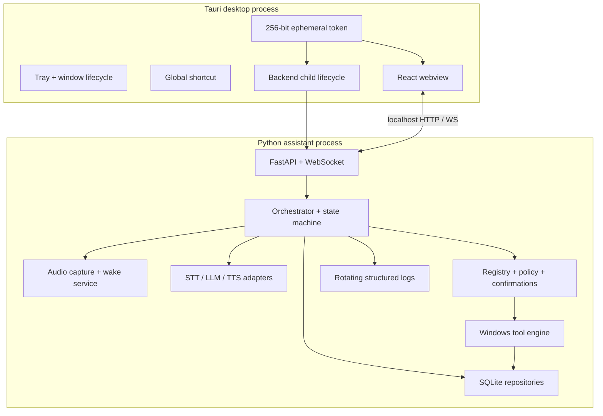
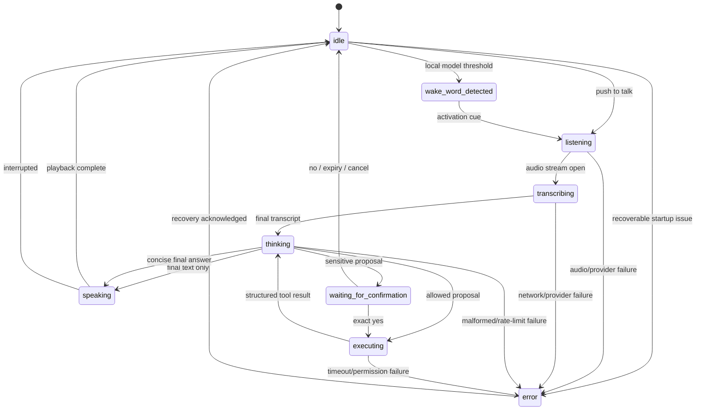

# Architecture

## Design goals

JARVIS is split at a deliberate process boundary. Tauri owns the Windows lifecycle and trusted local session credential; Python owns audio, providers, orchestration, policy, tools, and storage. The React webview never imports Windows automation libraries, and Gemini never receives an executor.

The priorities are:

1. Local wake detection and local speech output.
2. Explicit, replaceable provider contracts.
3. A narrow, validated desktop capability set.
4. Fail-closed confirmation and permission handling.
5. Observable state and graceful cancellation.
6. Mockable external and hardware boundaries.

## Processes and ownership



Tauri starts the backend with hidden standard streams and `CREATE_NO_WINDOW`. It keeps the `Child` handle, kills and waits for it during explicit exit, and lets the backend's own instance lock reject accidental duplicates. A second Tauri instance focuses the existing main window.

For a managed launch, Tauri passes `ASSISTANT_PORT=0`, an absolute one-time `ASSISTANT_READY_FILE`, and a 64-character high-entropy `ASSISTANT_READY_NONCE`. Python owns the socket bind, completes the FastAPI lifespan startup, and atomically writes `{"nonce":"…","port":49152,"pid":1234,"parent_pid":1200}` to that file. Tauri limits and strictly parses the response, verifies the nonce, requires the runtime to be either the process it spawned or its direct child, checks the reported port, and performs an authenticated health request. It deletes the file and exposes no token or URL to the webview before every check succeeds. This accepts both direct development launches and PyInstaller's one-file launcher/runtime pair without accepting an unrelated process. An explicit `ASSISTANT_PORT` preserves deterministic development setups.

If the child exits, Tauri immediately invalidates the published connection, restarts with a fresh readiness nonce, and publishes the new port only after the same handshake. WebSocket reconnection refreshes the Tauri connection configuration first, so an OS-assigned port may change across restarts. The session token remains process-ephemeral and stable across a managed child restart.

## Assistant state machine

Canonical UI states are lower-case strings:



Invalid transitions raise a domain error and are logged. A single async lock permits one active turn. Cancellation uses a per-turn event checked by audio iteration, vendor adapters, confirmation waits, tool execution, subprocesses, and speech playback.

Subprocesses never inherit the backend environment wholesale. A central builder copies only the Windows runtime variables required to launch a process, adds validated operation-scoped values, strips secret-bearing names, and redacts bounded stdout/stderr before returning it to the orchestration layer.

Wake detection is paused while output is speaking and during active capture. A short cooldown prevents a generated voice response or repeated buffer from reopening the pipeline.

## Turn flow

1. `WakeWordProvider` emits activation, or the API receives push-to-talk.
2. `AudioCapture` opens the configured 16 kHz mono input and yields bounded PCM frames.
3. `SpeechToTextProvider` yields partial/final `TranscriptEvent` objects.
4. The orchestrator builds a `ModelRequest` from the transcript, recent bounded context, summary, settings, permissions, and enabled tool declarations.
5. `LanguageModelProvider` returns a strict `ModelDecision`: either final text or one typed tool proposal. The Gemini adapter disables automatic function execution.
6. The registry rejects unknown, disabled, or malformed proposals before policy evaluation.
7. Policy either denies, requests confirmation, or allows execution.
8. The engine validates again, applies a timeout, executes, and records a structured result.
9. The tool result is returned to the language provider using the preserved function-call context. Gemini may then describe only the returned outcome.
10. Full text goes to the UI; a bounded spoken summary goes to `TextToSpeechProvider`.
11. Piper playback finishes or is interrupted; the runtime returns to idle and resumes wake detection.

The tool loop has a hard cap so a model cannot create unbounded action chains.

## Provider contracts

All providers are injected behind async interfaces:

- `SpeechToTextProvider`: consumes audio, yields partial/final events, honors end-of-speech and cancellation.
- `LanguageModelProvider`: receives a validated request and enabled tool declarations, then returns a validated decision; a second method accepts a structured tool result.
- `TextToSpeechProvider`: queues a speech request and supports cancellation.
- `WakeWordProvider`: starts, pauses, resumes, and stops local detection.

Provider-specific SDK types do not cross the adapter boundary. Domain errors classify missing configuration, authentication, quota/rate limit, network, timeout, cancellation, malformed responses, and unavailable local assets.

## Local protocol

The backend rejects any bind host other than loopback. Standalone development defaults to `127.0.0.1:8765`; the packaged host requests port `0` and learns the OS-assigned port through the authenticated readiness handshake.

All HTTP requests, including the health probe, require:

```http
X-Assistant-Token: <ephemeral session token>
```

WebSocket connects to `/v1/events` without putting credentials in the URL. Before any state is sent, the first frame must arrive within five seconds and validate against the client-message schema:

```json
{"type":"authenticate","token":"<ephemeral session token>"}
```

Tokens are compared in constant time. Invalid, missing, or late authentication closes the socket. Events have a typed envelope:

```json
{
  "type": "status_changed",
  "id": "event-id",
  "timestamp": "2026-07-16T04:00:00Z",
  "payload": {"state": "thinking", "detail": "Choosing an enabled tool"}
}
```

The shared schemas cover status, partial/final transcripts, responses, proposals, confirmations, results, errors, settings, and cancellation. The React client reconnects with capped exponential backoff and receives a fresh snapshot after reauthentication.

## Local API surface

The backend exposes authenticated endpoints for:

- State and health.
- Start/stop listening and cancellation.
- Text commands for accessibility/mock development.
- Confirmation decisions.
- Settings read/update.
- Tool listing and per-tool enable/permission updates.
- Redacted activity history.
- Provider and microphone status.
- Voice mute/interruption.
- Clear-local-data.

Input models forbid unknown fields. Route handlers call domain services rather than manipulating providers, tools, or SQLite directly.

## Storage

SQLite uses explicit migrations and foreign keys. Logical repositories cover:

| Data | Notes |
| --- | --- |
| Settings | Typed JSON/scalars; resettable defaults |
| Tool permissions | Enabled flag and permission level per registered tool |
| Conversations | Recent user/assistant turns when history is enabled |
| Summaries | Bounded long-term context, never raw audio |
| Recent commands | Text and timestamps, according to history policy |
| Tool executions | Redacted arguments/results, risk, duration, status |
| Confirmation decisions | Exact digest, decision, timestamps; no reusable approval for high risk |
| Preferred applications | Safe aliases/paths selected by the user |

API keys are excluded by model and repository design. `Clear local data` removes persisted user data, rotated logs, and app-owned screenshots, recreates defaults, and disables desktop startup registration while leaving external environment variables, Piper files, and wake models untouched.

## Windows action strategy

Each tool chooses the least fragile implementation:

1. Python standard library, native application URI, or application API.
2. Windows UI Automation for named controls.
3. pywin32 for window/process/clipboard interactions.
4. A named PowerShell operation with static command text and typed arguments.
5. Coordinate automation is not part of the normal registry.

Normal operation does not request administrator privileges. UIPI can block control of elevated windows; this becomes a structured `elevated_target` failure and never triggers automatic relaunch.

## Packaging

`scripts/build.ps1` runs all checks, uses PyInstaller to make a windowless `jarvis-assistant.exe`, renames it with the Rust target triple for Tauri's sidecar bundler, and invokes Tauri with the production sidecar overlay. Tauri creates current-user NSIS and/or MSI installers. The sidecar is authenticated at every launch with a new token.

## Extension points

- Add tools through the registry, not conditional branches in the prompt.
- Add providers through their interface and bootstrap factory.
- Add new settings through Pydantic, SQLite defaults/migration, shared schema/type, API patch model, and UI together.
- Add protocol events through the canonical event model and shared schema before emitting them.
