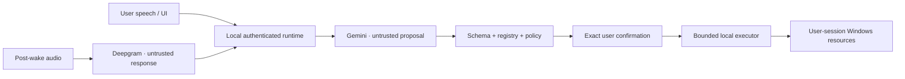

# Security model

## Threat assumptions

JARVIS processes untrusted natural language, untrusted model output, filenames/clipboard text that may contain hostile content, and responses from external providers. It runs in the user's desktop session, so a careless capability could damage personal data even without administrator rights.

The model and audio providers are not trusted execution principals. They can propose a registered action; only local policy can authorize it.

Out of scope: protection against malware already executing as the same Windows user, a compromised Python/Rust runtime, physical access to an unlocked machine, or a maliciously replaced installer. Code signing and endpoint protection remain deployment responsibilities.

## Trust boundaries



## Non-negotiable controls

- The backend binds to loopback only. Configuration rejects `0.0.0.0`, LAN addresses, and hostname ambiguity.
- Each desktop launch creates a 256-bit random token. The backend itself binds an ephemeral loopback port (unless an explicit development override is configured), then proves readiness with a separate one-time nonce and reports its runtime and parent PIDs. Tauri requires the runtime to be either the process it spawned or that process's direct child, then validates the port and completes an authenticated health check. Tokens are not placed in readiness files, WebSocket URLs, persistent storage, or logs.
- Every API/message body is modeled; unknown fields are rejected where they affect behavior.
- Gemini receives enabled tool declarations only and cannot invoke an automatic SDK executor.
- Unknown tools and malformed arguments fail before permission evaluation.
- Tool arguments are validated again immediately before execution.
- No unrestricted shell, Python evaluation, `Invoke-Expression`, encoded PowerShell, or model-generated script text is executed.
- Generic typing accepts plain text only: control characters that could submit a form or execute a command are rejected, terminal/shell and password targets are blocked at confirmation/execution time, and target-addressed UI Automation replaces global keyboard injection.
- Every child process receives a minimal Windows runtime environment plus validated operation-specific variables; API keys, session tokens, passwords, credentials, and secret/key variables are stripped. Child output is bounded and redacted again before it can reach Gemini, logs, or SQLite.
- Generic UI Automation cannot invoke arbitrary buttons or menu commands; it is restricted to tab/list selection and an allowlist of non-committing navigation controls.
- High-risk tools always need a fresh exact-action approval.
- A tool may report success only from its actual structured return value.
- Wake detection pauses while Piper speaks, reducing self-activation.
- Raw audio is not written to disk by default.
- Secrets are excluded from SQLite and log records.

## Permissions

| Level | Behavior |
| --- | --- |
| Disabled | Tool is omitted from Gemini and rejected if named anyway |
| Ask every time | Every proposed action creates a confirmation |
| Allow during this session | Low/medium-risk actions may proceed until backend exit |
| Always allow | Persisted for eligible low/medium-risk actions |

`always_allow` is never honored for high-risk tools. The UI disables that option and backend policy independently enforces the rule.

Disabling a tool takes effect before the next model request and again during execution-time authorization. Session grants live only in memory.

## Confirmation integrity

A pending confirmation records:

- Random request ID.
- Tool name.
- Strictly validated canonical arguments.
- SHA-256 digest of tool name plus canonical JSON arguments.
- Human-readable exact action preview.
- Risk and affected resources.
- Creation and expiry timestamps.

Only the explicit decisions `yes` or `no` are valid. Unrelated speech/text is not approval. At resolution, the manager verifies that the request is pending, unexpired, unresolved, and has the same digest. Requests are single-use. Changed paths, processes, commands, or arguments require a new confirmation.

Cancellation, denial, expiry, digest mismatch, and replay are logged as decisions and never invoke the tool.

## Paths and files

Path tools:

- Resolve default Desktop, Documents, and Downloads roots with `SHGetKnownFolderPath`, honoring OneDrive/domain-policy redirection; portable home-folder fallbacks are used per folder when Windows lookup fails.
- Reject empty strings, NULs, Windows device namespaces such as `\\.\` and `\\?\`, and ambiguous device names.
- Normalize and resolve paths before preview and execution.
- Keep search result counts, file sizes, traversal counts, and execution time bounded.
- Reject protected system locations for mutable operations unless a separately designed elevated feature is explicitly introduced.
- Avoid following symlinks/reparse points for recursive destructive operations.
- Use literal path APIs, not shell-expanded strings.
- On Windows, capture identity from an opened handle and keep the same object locked through existing-file writes, moves, and deletion. Move also locks the destination ancestor chain; recursive delete retains directory handles and fails closed on reparse points or concurrent additions.
- Revalidate existence/type and confirmation digest at execution time; portable non-Windows development uses the documented path-based fallback.

Deletion is high risk, always confirmed, and deliberately avoids implicit wildcards. A file/folder moved between preview and execution causes failure. Windows sharing conflicts also fail safely rather than mutating an object that could not be locked.

## URLs

The website tool accepts `http` or `https` only. It rejects credentials in URLs, control characters, dangerous schemes (`file:`, `javascript:`, `data:`, `shell:`), and malformed hosts. Opening a URL delegates to the configured Windows browser; JARVIS does not submit forms or enter credentials through this tool.

## PowerShell

PowerShell is an implementation detail behind named operations. Each operation has its own Pydantic model, static script/argument template, timeout, output cap, and risk classification.

Prohibited:

- Arbitrary `-Command` text from Gemini/user arguments.
- `Invoke-Expression`, `iex`, encoded commands, profile loading, or string-concatenated pipelines.
- Shell metacharacters inside identifiers that permit only names/IDs.
- Hidden elevation, UAC bypass, or credential prompts.
- Unbounded stdout/stderr capture.

Prefer direct executables such as `shutdown.exe` with an argument array when PowerShell adds no safety or capability.

## Developer mode

Developer mode is disabled by default and is not arbitrary shell access. An approved command is an administrator/user-authored configuration containing:

- Exact executable.
- Fixed arguments plus separately validated parameter slots.
- Trusted working-directory root.
- Output and time limits.
- Risk and visible preview.

Every run is confirmed and audited. Scripts must live under configured trusted roots; model output cannot add a new executable, switch, working directory, or script path.

Trusted scripts require both membership under `TRUSTED_SCRIPT_ROOTS_JSON` and an exact path in `TRUSTED_SCRIPT_ALLOWLIST_JSON`. Their digest is captured for confirmation. Execution verifies bytes through a Windows file handle that denies write/delete sharing and remains open through child completion (or through a cleaned-up verified copy on other platforms), so a path swap cannot occur between verification and interpreter open. `.py` files are disabled unless `TRUSTED_PYTHON_EXECUTABLE_PATH` names a fixed trusted interpreter. Configured development commands are fixed argument arrays in `DEVELOPMENT_COMMANDS_JSON` and never shell strings. Do not place a trusted root inside a directory writable by the assistant's file tools.

Preferred application aliases are persisted as a strictly validated string map. Values must be absolute `.exe` paths and are rechecked against existing Program Files/SystemRoot trust roots at every resolution. They never carry arguments and do not extend the executable trust boundary.

## Secrets

Development uses environment variables. `.env` is ignored by Git, but environment variables can still be inspected by processes running as the same user.

Production can enable the `keyring` adapter to read Deepgram/Gemini values from Windows Credential Manager. The exact Credential Manager service is `JarvisAssistant`; the allowlisted usernames are `DEEPGRAM_API_KEY` and `GEMINI_API_KEY`.

After a full (non-mock) setup, store each value without echoing it or placing it in shell history:

```powershell
.\.venv\Scripts\python.exe -c "from getpass import getpass; from jarvis_assistant.secrets_store import WindowsCredentialStore as S; S.set('DEEPGRAM_API_KEY', getpass('Deepgram key: '))"
.\.venv\Scripts\python.exe -c "from getpass import getpass; from jarvis_assistant.secrets_store import WindowsCredentialStore as S; S.set('GEMINI_API_KEY', getpass('Gemini key: '))"
```

Leave the two key values blank in `.env` and set:

```dotenv
ASSISTANT_USE_CREDENTIAL_MANAGER=true
```

Delete the credentials explicitly when rotating or decommissioning them:

```powershell
.\.venv\Scripts\python.exe -c "from jarvis_assistant.secrets_store import WindowsCredentialStore as S; S.delete('DEEPGRAM_API_KEY')"
.\.venv\Scripts\python.exe -c "from jarvis_assistant.secrets_store import WindowsCredentialStore as S; S.delete('GEMINI_API_KEY')"
```

**Clear local data does not delete Credential Manager entries.** That separation prevents a routine history reset from unexpectedly destroying production credentials.

Never:

- Put keys in React/Vite variables; `VITE_*` values are compiled into frontend assets.
- Return full provider keys from status endpoints.
- Persist provider keys in settings/SQLite.
- Include auth headers or tokens in exception strings.

## Logging and audit

Structured logs include timestamps, levels, event names, state changes, provider operation class (not content/secrets), tool metadata, duration, decisions, and exception category. Rotating files cap disk use.

The redactor recursively masks fields and strings resembling:

- API keys, bearer/auth headers, and session tokens.
- Passwords, credentials, secrets, cookies, and access/refresh tokens.
- Clipboard contents.
- Private file contents.
- Raw transcript/audio content where the event does not require it.

Activity history is user-facing audit data, not debug logging. Tool arguments/results are redacted before persistence. Users can clear both local data and rotated logs from documented locations.

## Network behavior

- Wake-word inference and Piper TTS remain local.
- Microphone bytes go to Deepgram only after wake/push-to-talk activation.
- Transcripts, bounded context, and enabled tool schemas go to Gemini.
- Tool results sent back to Gemini are minimized and redacted where practical.
- Willow WIS is optional; users are responsible for the privacy/TLS posture of their configured server.
- No telemetry or analytics endpoint is included.

## Elevated windows

Windows User Interface Privilege Isolation may block a non-elevated process from controlling an elevated application. Tools should detect access denial where possible and return: “Windows blocked control of an elevated application.” The assistant must not relaunch itself as administrator unless a future, explicit, separately confirmed feature is designed and reviewed.

## Security review checklist for new capabilities

1. Is the action materially different from an existing tool? If yes, create a new tool/permission.
2. Can a native/application API replace UI or shell automation?
3. Are argument and result models strict and bounded?
4. Does the preview show every affected path, process, recipient, command, or system change?
5. Is risk correctly classified, with forced confirmation where needed?
6. Can resources change between preview and execution? Revalidate/digest them.
7. Does cancellation stop subprocesses and partial work safely?
8. Are output, time, recursion, file size, and result count bounded?
9. Are logs/history redacted before serialization?
10. Are disabled/denied/malformed/expiry/replay tests present?
